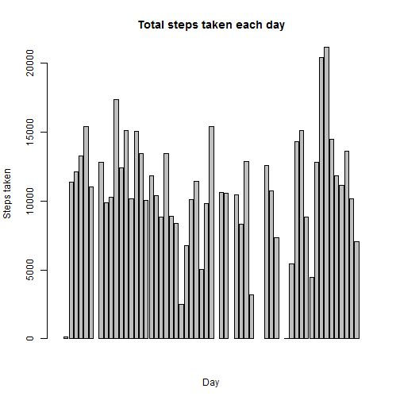
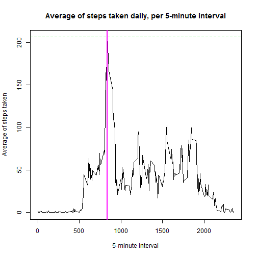
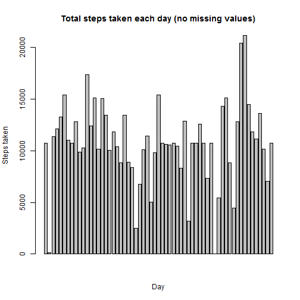
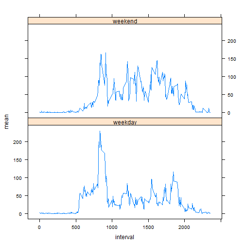

# Reproducible Research: Peer Assessment 1

The following document is an assignment in the course "Reproducible Research", a part of the Specialization in Data Science authorized by JHU.  
This assignment makes use of data from a personal activity monitoring device, which collects data at 5-minute intervals throughout the day. The data consists of two months of data from an anonymous individual collected during the months of October and November, 2012 and include the number of steps taken in 5-minute intervals each day.
Making use and analyzing the data, we'll answer the following questions:
*What is the mean total number of steps taken per-day?
*What is the average daily activity pattern?
*Are there differences in activity patterns between weekdays and weekends?


## Loading and preprocessing the data

1. Step 1: unzip. It is assumed the file "activity.zip" exists and is in the working directory. Unzipping will create the file "activity.csv" in the working directory.
2. Step 2: read the file "activity.csv" into the dataframe "data" within R.
3. Step 3: convert the column "date" from class factor to class date. 


```r
unzip("activity.zip")
data <- read.csv("activity.csv")
data$date <- as.Date(data$date)
str(data)
```

```
## 'data.frame':	17568 obs. of  3 variables:
##  $ steps   : int  NA NA NA NA NA NA NA NA NA NA ...
##  $ date    : Date, format: "2012-10-01" "2012-10-01" ...
##  $ interval: int  0 5 10 15 20 25 30 35 40 45 ...
```


## What is mean total number of steps taken per day?
1. Summarize data (total steps, mean and median) in a dataframe
2. Plot it. I selected a bar plot instead of a histogram, since it would allow me to draw one variable related to another (instead of one variable related to its own frequency, as an histogram would do)
3. Calculate mean and median, then present them.


```r
require(plyr)
```

```
## Loading required package: plyr
```

```r
summeddata <- ddply(data, .(date), summarize, Total = sum(steps), Mean = mean(steps), 
    Median = median(steps))
barplot(summeddata$Total, main = "Total steps taken each day", xlab = "Day", 
    ylab = "Steps taken")
```

 

```r
summedMean <- as.integer(mean(summeddata$Total, na.rm = TRUE))
summedMedian <- as.integer(median(summeddata$Total, na.rm = TRUE))
```

The mean of total steps taken per day is 10766 steps.  
The median of total steps taken per day is 10765 steps.

## What is the average daily activity pattern?
1. Summarize data per 5-minute interval in a data frame.
2. Plot the time series
3. Identify the maximum value of average steps taken, the 5-minute interval at which that maximum occurs, and report it in writing and within the plot.


```r
summ2 <- ddply(data, .(interval), summarize, mean = round(mean(steps, na.rm = TRUE), 
    2))
with(summ2, plot(interval, mean, type = "l", main = "Average of steps taken daily, per 5-minute interval", 
    xlab = "5-minute interval", ylab = "Average of steps taken"))
maxmeansteps <- max(summ2$mean)
wheremaxmeansteps <- which.max(summ2$mean)
maxmeaninterval <- summ2[wheremaxmeansteps, 1]
abline(v = maxmeaninterval, col = "magenta", lwd = 2)
abline(h = maxmeansteps, col = "green", lwd = 1, lty = 2)
```

 

The 5 minute interval where most steps are taken in average is 835. A mean of 206.17 steps are taken at 835 in the morning.   

## Imputing missing values
Step 1: Calculate and report the total number of missing values in the original dataset.


```r
miss <- sum(is.na(data$steps))
```

There is a total of 2304 missing values in the original dataset.  

Step 2: In order to fill in the missing values, each one is replaced with the mean for that specific 5-minute interval, computed before.


```r
data2 <- data
for (i in seq_along(data2$steps)) {
    if (is.na(data2[i, "steps"])) {
        daysteps <- subset(summ2, summ2$interval == data2[i, "interval"])
        data2[i, "steps"] <- daysteps$mean
    }
}
miss2 <- sum(is.na(data2$steps))
```


There is a total of 0 missing values in the new dataset.  

Next, we calculate the total number of steps taken each day; the mean and the median. The methods used are the same that those used in the first part of the assignment.

```r
summeddata2 <- ddply(data2, .(date), summarize, Total = sum(steps), Mean = mean(steps), 
    Median = median(steps))
barplot(summeddata2$Total, main = "Total steps taken each day (no missing values)", 
    xlab = "Day", ylab = "Steps taken")
```

 

```r
summedMean2 <- as.integer(mean(summeddata2$Total, na.rm = TRUE))
summedMedian2 <- as.integer(median(summeddata2$Total, na.rm = TRUE))
```

The mean of total steps taken per day (once all missing values are filled-in) is 10766 steps.  
The mean of total steps taken per day (without filling-in missing values) was 10766 steps.  

The median of total steps taken per day (once all missing values are filled-in) is 10766 steps.  
The median of total steps taken per day (without filling-in missing values) was 10765 steps.

With this particular strategy for dealing with missing values (i.e. replacing them with the average for that specific 5-minute interval) there is no appreciable difference between the means and the medians of both datasets.

## Are there differences in activity patterns between weekdays and weekends?

1. From the dataset without missing values, create a new factor variable with two levels - "weekday" and "weekend", indicating whether a given date is a weekday or weekend day.
2. Make plots comparing the average number of steps taken each 5-minute interval, during weekends and during weekdays.


```r
require(lattice)
```

```
## Loading required package: lattice
```

```r
wd <- ifelse(weekdays(data2$date) == "sábado" | weekdays(data2$date) == "domingo", 
    "weekend", "weekday")
data2$wd <- factor(wd, levels = unique(wd), ordered = TRUE)
summ3 <- ddply(data2, .(interval, wd), summarize, mean = round(mean(steps, na.rm = TRUE), 
    2))
xyplot(mean ~ interval | wd, data = summ3, type = "l", layout = c(1, 2))
```

 

We can see the pattern of waking step activity is different on weekends than on weekdays, in average. While on weekdays there are peaks of stepping activity centered near 8:30AM and -a lower one- near 6:00PM, on weekends there is a peak around 8:30 but lower, and the activity is more spread throughout the day.  
The peak on weekends could be explained if the subject works on Saturday's morning, or if he/she trains on weekends morning. However, there could be a bias introduced by the strategy for filling-in the missing values: if the missing values were proportionally more concentrated on weekends (e.g., the subject didn't wear the wearable tracking monitor on Sundays at all), then replacing the whole Sunday information with the average of each 5 minutes interval would make look as if there were more weekday-like activity than in reality.

*Ricardo González, August 2014.*    
**Reproducible Research - Data Science Specialization offered by Coursera**  
**Authorized by Johns Hopkins University**  

